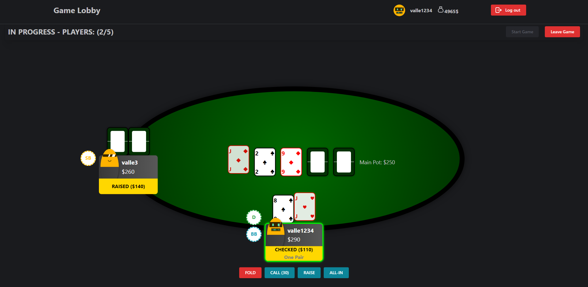

# Multiplayer Card Games

## Introduction
>A multiplayer poker game based on the rules of Texas Hold'em, written in Java, TypeScript, HTML, and CSS, using the Spring Boot and React
> Frameworks, a WebSocket Protocol and Keycloak for authentication.
&copy; Valentin Laucht

The game consists of a lobby where all connected players can create games or join tables of other players. 
Each table is limited to a maximum of 5 players, and the game can start once 2 players have taken their seats. 
When the table limit is reached, the game starts automatically.

When a player joins a table, the buy-in amount is deducted from their balance, and they are credited with a certain number of game chips for that game. If a player leaves the table, 
he receives the remaining game chips as a credit on his balance. If a player leaves the table during a game, he is considered to have folded and loses the game chips he has already bet.

Once the game has started, it can be played according to the standard Texas Hold'em rules.



## Installation
### Prerequisites
- Java 17
- Node.js 18
- Docker

### Running the application
To build this project, navigate to the ```server``` folder and run the following command:
```./gradlew clean build```

To start the application, run the following command from the root:
```docker-compose up```

The application is now running on ```localhost:3000```